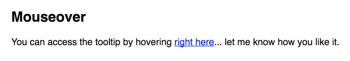

# React SimpleTooltip

[](https://travis-ci.org/sergiocruz/react-simpletooltip)
[](https://www.bithound.io/github/sergiocruz/react-simpletooltip)
[](https://badge.fury.io/js/react-simpletooltip)

[React SimpleTooltip](https://github.com/sergiocruz/react-simpletooltip) is an ultra-simplistic tooltip plugin for React apps. It is simple to work with and it doesn't make any assumptions about the app you're using it on.

## Live demo

If you are curious about how this component looks in real life, check it out on the [react-simpletooltip page](https://sergiocruz.github.io/react-simpletooltip).

## Usage

Interested in trying it out? To use React SimpleTooltip, run `npm install react-simpletooltip` to get started.



```javascript
function MyComponent() {
  const tooltip = (
    <Tooltip>Hello from Tooltip</Tooltip>
  );

  return (
    <div>
      <OnMouseOverTooltip tooltip={tooltip}>
        <a href="#">hover me!</a>
      </OnMouseOverTooltip>
    </div>
  );
}
```
